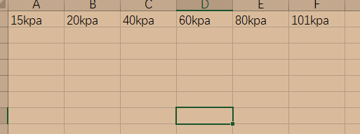

# jy_AI
jy_AI实验室学习项目
# 实验数据处理

### 需求分析

- 读取指定文件夹下的火灾数据（CSV文件）中的指定时间段对应的数据，并且将所有数据输出为两个EXCEL文件热辐射.xlsx和温度.xlsx

### 现有数据分析

- 现有数据分析
  - 数据文件名 ==NO.*-R0.csv==
  - 数据表头
    - 由序号、时间（年/月/日 时:分:秒）、温度、辐射热
    - 
  - 输出excel
    - 输出 热辐射.xlsx和温度.xlsx
      - 热辐射.xlsx
      - 
      - 温度.xlsx
      - 

### 步骤分析

- 文件预处理
  - 文件重命名
  - 输入：NO.*-R0.csv
  - 输出：NO\_*\_R0.csv
- 文件批量读取
  - 读取当前文件夹下所有的CSV文件，并且按照文件名生成对应变量
  - 输入：NO\_*\_R0.csv
  - 输出：NO\_*\_R0
- 数据处理
  - **处理时间**
    - 需求：将（年/月/日 时:分:秒）的数据用对应秒数替换
    - 
    - 步骤
      - 按照空格分列，并且取第二部分得到(hh:mm:ss)
      - 将第二部分数据转换成秒数，替换原来的时间列
  - 提取数据
    - 需求：根据输入的时间列表$[(h_1h_1:m_1m_1:s_1s_1) (h_2h_2:m_2m_2:s_2s_2) (h_nh_n:m_nm_n:s_ns_n)] $，提取NO\_*\_R0中的对应行数据
    - 步骤：
      - 将输入的时间转换为对应秒数
      - 将输入的秒数和NO\_*\_R0中的时间列进行筛选，得到对应行数据
      - 提取出的数据存在变量Res_tem_NO\_*\_R0,Res_rad_NO\_\*\_R0中
- 
