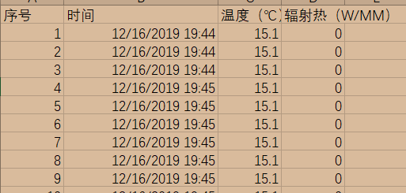
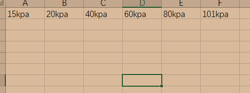

# 火灾数据处理

### 需求分析

- 读取指定文件夹下的火灾数据（CSV文件）中的指定时间段对应的数据，并且将所有数据输出为两个EXCEL文件热辐射.xlsx和温度.xlsx

### 现有数据分析

- 现有数据分析

  - 数据文件名 ==NO.*-R0.csv==

  - 数据表头
    - 由序号、时间（年/月/日 时:分:秒）、温度、辐射热
    - 
  - 输出excel
    - 输出 热辐射.xlsx和温度.xlsx
      - 热辐射.xlsx
      - 
      - 温度.xlsx
      - 

### 步骤分析

- 文件预处理
  - 文件重命名——实现函数：==fire_rename​==
  - 输入：NO.*-R0.csv所在（绝对）路径（path）
  - 输出：文件重命名完毕
- 文件批量读取
  - 读取当前文件夹下所有的CSV文件，并且按照文件名生成对应变量
  - 输入：NO\_*\_R0.csv所在的路径
  - 输出：在matlab工作区的NO\_*\_R0
  - 其中，创建函数==cell2str==，将cell中的元素转换为string，格式为：y = cell2str(x,position)）
- 数据处理
  - 数据提取
    - 需求：根据输入的时间列表$[(h_1h_1:m_1m_1:s_1s_1) (h_2h_2:m_2m_2:s_2s_2) (h_nh_n:m_nm_n:s_ns_n)] $，提取NO\_*\_R0中的对应行数据
    - 步骤：
      - 将需要提取的时间转为秒数：==time2sec==函数：将始末时间转为对应秒数
      - 更换变量名和NO_*_R0数据时间列
      - 更换NO_*_R0数据时间列：==analyzetime==函数：将单个待处理数据重命名并把第而列时间删除替换为秒数。用for循环实现    批量更换。
      - 提取数据：==exdata==函数：将清理好的数据（table）进行选择提取！（核心）

  - 数据输出（均用循环）
    - 需求：将处理好的table格式的结果按需要格式输出成Excel中
    - 步骤
      - 输出温度数据
      - 输出热辐射数据
      - 写入到excel中：R0为一张Excel，T为一张；其中，每类共分为若干sheet，每个sheet分别为不同其气压工况。

###代码结构图

